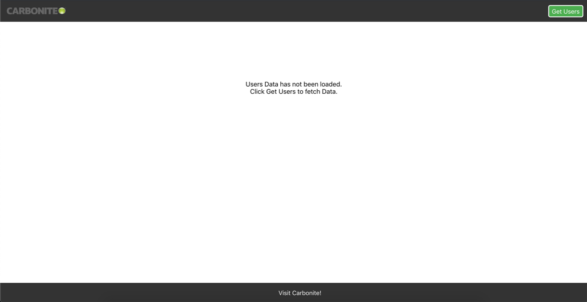
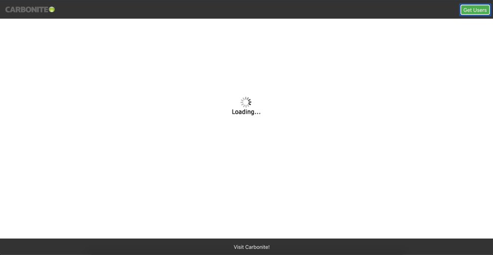
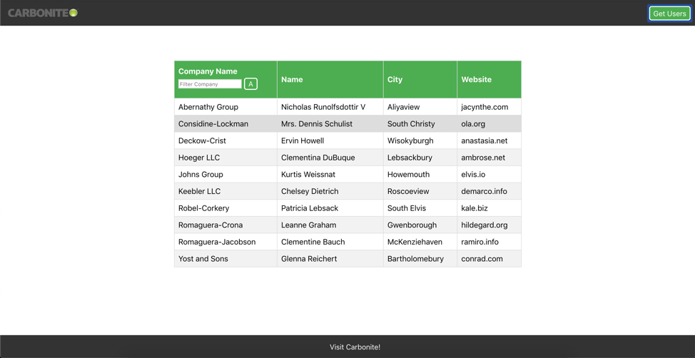

# SINGLE PAGE REACT APPLICATION

To run this application, simply follow the steps below:
1. Download/clone the git repository https://github.com/pooja169usp/Single-Page-React-App
2. Extract the zip file and navigate to the extracted location/project folder in the terminal.
3. Run the following commands:
> npm install
####
> npm start

##

In this project, WebPage is the parent component that holds all the other components including the Header, Footer, UsersTable and UserRow

### WebPage
A class component that fetches data from API on click of Get Users button and passes the data onto Userstable for rendering.
It has following states:
    *hasErrors* is set if an error occurs while fetching data
    *showUsers* is set on successful data fetch
    *isLoading* is set when the data fetch is initiated and reset on successful data fetch
    *usersData* holds the response from the fetch API
    *parsedUsersData* hold the paserd information from usersData 
 
### Header
Functional component that renders Header. It has the Get Users button which on click fetches the users by making a get request using fetch API

### Footer
Functional component that renders Footer. It has a link Visit Carbonite! that opens up a new tab

### UsersTable
UsersTable is a class component. On load of the web page and before the Get Users button is clicked, UsersTable component renders renders a user friendly text saying the data has not been loaded. 

On click of Get Users, while fetching the data from API(determined by property isLoading, this component renders a loading gif to indicate to the users that the data is being fetched. 

After the data is loaded successfully, UsersTable renders a table with details of users on click of Get Users button in Header Component(which is determined by the property showUsers that is passed from WebPage).

It has following states:
    *sortAscending* default set to false, denotes the current sorting order
    *buttonText* deafult set to "A" denoting Ascending order
Initializing state to false, because on render the table data is already sorted in ascending order

##### Helper functions
> *sortTable* sorts the data in either ascending/descending order. Each time the Sort button is clicked, the sortAscending and buttonText states are toggled. Ref: W3 Schools for sorting

> *filterTable* filters the data based on the filter text entered in the input text box. The data is filtered by setting the display property to none for the rows that do not match with the filter text entered

### UserRow
Functional component to render the rows in the Users table with the data passed in by UsersTable as props.user

##

This project was bootstrapped with [Create React App](https://github.com/facebook/create-react-app).

## Available Scripts

In the project directory, you can run:

### `npm start`

Runs the app in the development mode. 
Open [http://localhost:3000](http://localhost:3000) to view it in the browser.

The page will reload if you make edits. 
You will also see any lint errors in the console.

### `npm test`

Launches the test runner in the interactive watch mode. 
See the section about [running tests](https://facebook.github.io/create-react-app/docs/running-tests) for more information.

### `npm run build`

Builds the app for production to the `build` folder. 
It correctly bundles React in production mode and optimizes the build for the best performance.

The build is minified and the filenames include the hashes. 
Your app is ready to be deployed!

See the section about [deployment](https://facebook.github.io/create-react-app/docs/deployment) for more information.

### `npm run eject`

**Note: this is a one-way operation. Once you `eject`, you can’t go back!**

If you aren’t satisfied with the build tool and configuration choices, you can `eject` at any time. This command will remove the single build dependency from your project.

Instead, it will copy all the configuration files and the transitive dependencies (Webpack, Babel, ESLint, etc) right into your project so you have full control over them. All of the commands except `eject` will still work, but they will point to the copied scripts so you can tweak them. At this point you’re on your own.

You don’t have to ever use `eject`. The curated feature set is suitable for small and middle deployments, and you shouldn’t feel obligated to use this feature. However we understand that this tool wouldn’t be useful if you couldn’t customize it when you are ready for it.

## Learn More

You can learn more in the [Create React App documentation](https://facebook.github.io/create-react-app/docs/getting-started).

To learn React, check out the [React documentation](https://reactjs.org/).

### Code Splitting

This section has moved here: https://facebook.github.io/create-react-app/docs/code-splitting

### Analyzing the Bundle Size

This section has moved here: https://facebook.github.io/create-react-app/docs/analyzing-the-bundle-size

### Making a Progressive Web App

This section has moved here: https://facebook.github.io/create-react-app/docs/making-a-progressive-web-app

### Advanced Configuration

This section has moved here: https://facebook.github.io/create-react-app/docs/advanced-configuration

### Deployment

This section has moved here: https://facebook.github.io/create-react-app/docs/deployment

### `npm run build` fails to minify

This section has moved here: https://facebook.github.io/create-react-app/docs/troubleshooting#npm-run-build-fails-to-minify
